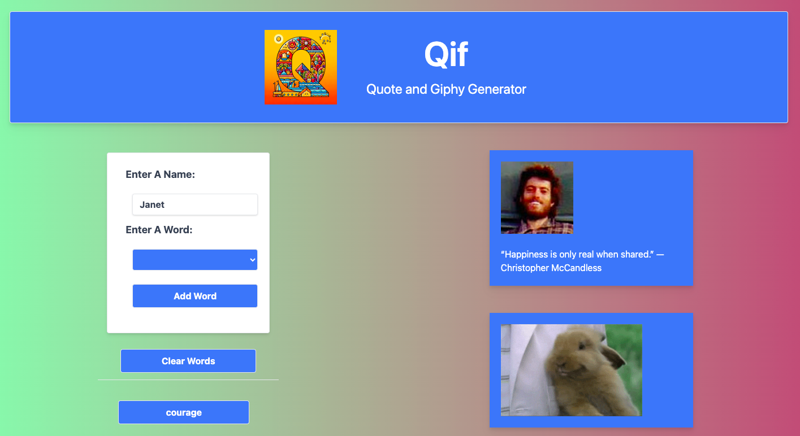
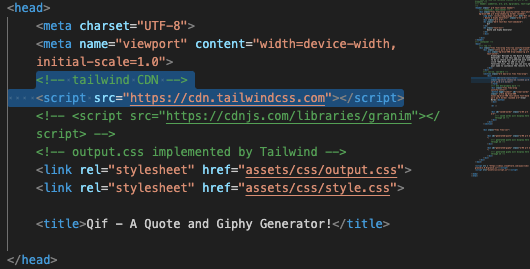
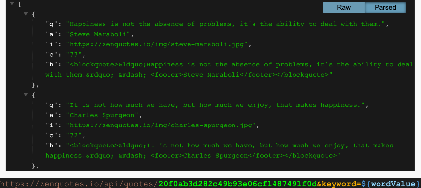

# 🌈Qif - A Quote and Giphy Generator🌈
### [View Project Here](https://apixa25.github.io/Qif-Generator/ "Qif - A Quote and Giphy Generator") 

| Technology Used    | Resource URL |
| --------  | ------- |
| HTML      | https://developer.mozilla.org/en-US/docs/Web/HTML |
| CSS       | https://developer.mozilla.org/en-US/docs/Web/CSS |
| JavaScript | https://developer.mozilla.org/en-US/docs/Web/JavaScript |
| Tailwind CSS | https://tailwindcss.com/ |
| Granim | https://sarcadass.github.io/granim.js/index.html |
| Git       | https://git-scm.com/ |
| GitHub     | https://github.com/ |
| VSCode    | https://code.visualstudio.com/ |

## Table of Contents

* [Description](#description)
* [Installation](#installation)
* [Usage](#usage)
* [Credits](#credits)
* [License](#license)

## Description:
Our web-based application generates a quote and a giphy image by selecting the word of your choice. The user is presented with a drop-down box for their word and an “Add Word” button. Upon adding the word, a random quote and gif image will display based off of the word selected. The word will then be saved for the user to click as many times as they desire, each time refreshing with a new quote and gif image. The user is also able to click the “Clear Words” button to remove all their previously added words. For this projectused Zenquotes.io and giphy.com. 
 
How to use this app:

* Use the drop down field to select a word
* Click "Add Word"
* Repeat steps 1 & 2 as needed
* Click the buttons of your favorite saved words
* View your quote and giphy!

### Lessons Learned

#### 1. Working with Tailwind
We learned different classes in Tailwind and how to properly use them to affect our layout.
 

#### 2. Working with granim
We learned how to create a gradient background using granim. We were reminded on the z-index during this part of the project.
 

#### 3. TBD
Description
 

#### 4. TBD
Description
 

#### Synopsis
Description

## Installation

1. Create a new repository on GitHub, to store this project.
2. Clone the repository to your computer.
3. Copy files to your own repository.
4. Make changes to the code.
5. Commit the changes to the local repo.
6. Push the changes to the remote repo.

## Usage

This is a quote and giphy generator app. If you would like to use this app follow the installation steps and curate it to your needs. If you would like to use this app to generate your own results, follow the steps under the description above and click the link at the top of this page.

## License

MIT License
Copyright (c) 2023 Twixmixy / Janet Webster

## About The Authors
### Andersen Petersen

- [GitHub] (https://github.com/Antedbell20)
- [LinkedIn](https://www.linkedin.com/in/andi-petersen-60016b187/)

### Steven Sills II
Description
- [LinkedIn](https://www.linkedin.com/in/steven-sills-ii-90781b53/)
- [Github](https://github.com/Apixa25)
- [Portfolio](https://apixa25.github.io/steven-sills-portfolio/)

### Janet Webster
Full Stack MERN Software Engineer in training.

- [GitHub](https://github.com/TwixmixyJanet/)
- [LinkedIn](https://www.linkedin.com/in/twixmixy/)
- [Twitter](https://twitter.com/Twixmixy)
- [WakaTime](https://wakatime.com/@Twixmixy)

<!-- Information below is to be deleted before turning in the homework. It is currently here for reference. -->

## PRE-WORK NOTES:
Group project 1
With our web-based application you will be able to generate a quote and a giphy image by inputting the word of your choice. The user is presented with an input box for their word and an “Add Word” button. Upon adding the word a random quote and gif image will display based off of the word input. The word will then be saved for the user to click as many times as they desire, each time refreshing with a new quote and gif image. The user is also able to click the “Clear Words” button to remove all their previously added words. For this project we will be using Zenquotes.io and giphy.com.

- PSEUDOCODE:

- WHEN THE USER HITS THE PAGE THEY ARE PRESENTED WITH A TEXT FIELD FOR THEM TO ENTER THEIR FAVORITE WORD.
- IF THEY PUT IN THEIR NAME THEY CAN MAKE THE QUOTE CUTOM TO THEM: I.E. "GREETINGS X!"
- WHEN THEY HIT SUBMIT IT WILL RANDOMLY GENERATE A QUOTE FOR THEM BASED OFF THEIR INPUT WORD.
- ALSO WHEN THEY HIT SUBMIT THEY ARE PRESENTED WITH A RANDOMLY GENERATED GIF.

Use a CSS framework other than Bootstrap.

- GOING TO USE TAILWIND FOR CSS
  Be deployed to GitHub Pages.
- DONE
  Be interactive (i.e: accept and respond to user input).
- WE HAVE ONE DATA POINT! ENTER A "WORD" MAYBE LATER AD "NAME"
  Use at least two server-side APIs.
- QUOTE API AND GIFY API
  Does not use alerts, confirms, or prompts (use modals).
- OK - THINK OF DOING A MODAL TO SOCIAL MEDIA
  Use client-side storage to store persistent data.
- MAYBE KEEP THEIR NAME, OR WORD THAT THEY GENERATED
  Be responsive.
- MAKE SURE TO USE TAILWIND PROPERTIES TO MAKE IT MOBILE FRIENDLY
  - OUR INTENTION IS TO USE THE LAYOUT AND PROPERTIES FROM THE WEATHER DASHBOARD
    Have a polished UI.
- GOING TO USE TAILWIND PROPERTIES TO MAKE SURE ITS POLLISHED
  Have a clean repository that meets quality coding standards (file structure, naming conventions, follows best practices for class/id-naming conventions, indentation, quality comments, etc.).
- AS IT STANDS RIGHT NOW ONE SET OF HANDS ON THE CODE AT A TIME, WE WILL REVIEW OUR ASSETS AND FILE NAMES
  Have a quality README (with unique name, description, technologies used, screenshot, and link to deployed application).
- FUNCTIONS SHOULD ALWAYS BE NAMED BY VERBS, STATIC ITEMS SHOULD BE A NOUN
  - WE WILL USE THE FORMAT OF OUR PREVIOUS README'S

ACTION ITEMS:

- LAYOUT THE HTML FOR OUR APP USING TAILWIND

  - LINKING TO TAILWIND CSS IN OUR HEADER
  - IN THE HTML LINK TO THE SCRIPT USING VUE
  - MIMIC THE BOOTSTRAP CLASSES AND TURN THEM INTO TAILWIND

- JAVASCRIPT = USE AS MANY OF THE FUNCTIONS AS POSSIBLY FROM WHAT WE DID IN OUR WEATHER APP,
  ASK OURSELVES: HOW CAN I TURN THIS INTO VUE.JS?

- API STUFF = NEED TO BE ABLE TO:
  FETCH THE DATA - WHAT DATA? FETCH A QUOTE BASED OFF THE WORD INPUT, THE WORD IS THE CATEGORY
  VIEW THE DATA = THIS IS THE "RESPONSE" FROM THE API TO US (THIS IS FOR US, NOT THE USER)
  DIPLAY THE DATA = THIS IS THE INERHTML PORITON = THIS IS THE PART THAT THE USER ACTUALLY SEES

## RESOURCES:

- Quotes API: https://zenquotes.io/
- GIPHY API: https://developers.giphy.com/dashboard/ -> APIkey: T5jopP1Bh8SGzs6g1b6MrMdb26IrnDeC
- CSS Framework: https://tailwindcss.com/
- Team Six Document: https://docs.google.com/document/d/177W1FZIYZbJCQoIUrh2FMPXjx8nMj2S77OAB2fnyOl0/edit
