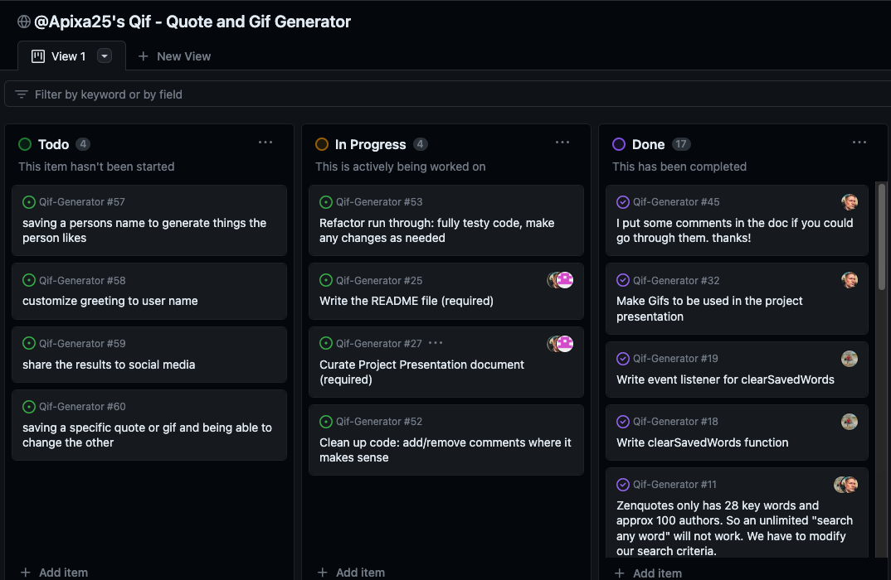

# 🌈Qif - A Quote and Giphy Generator🌈
### [View Project Here](https://apixa25.github.io/Qif-Generator/ "Qif - A Quote and Giphy Generator") 

| Technology Used    | Resource URL |
| --------  | ------- |
| HTML      | https://developer.mozilla.org/en-US/docs/Web/HTML |
| CSS       | https://developer.mozilla.org/en-US/docs/Web/CSS |
| JavaScript | https://developer.mozilla.org/en-US/docs/Web/JavaScript |
| Tailwind CSS | https://tailwindcss.com/ |
| Granim | https://sarcadass.github.io/granim.js/index.html |
| Git       | https://git-scm.com/ |
| GitHub     | https://github.com/ |
| VSCode    | https://code.visualstudio.com/ |

## Table of Contents

* [Description](#description)
* [Installation](#installation)
* [Usage](#usage)
* [Credits](#credits)
* [License](#license)

## Description:
Our web-based application generates a quote and a giphy image by selecting the word of your choice. The user is presented with a drop-down box for their word and an “Add Word” button. Upon adding the word, a random quote and gif image will display based off of the word selected. The word will then be saved for the user to click as many times as they desire, each time refreshing with a new quote and gif image. The user is also able to click the “Clear Words” button to remove all their previously added words. For this project we used Zenquotes.io and giphy.com. 
 

How to use this app:

* Use the drop down field to select a word
* Click "Add Word"
* Repeat steps 1 & 2 as needed
* Click the buttons of your favorite saved words
* View your quote and giphy!

### User Stories
| As a User    | I Want To |     So That     | HTML  | JavaScript |
| --------  | ------- | ---------  | ---------| ----- |
| As a USER | I want to put a word into the input box | I can search for a quote and Gif based on that word | field input | the user input is passed to the submitWord function |
| As a USER | FIRST: Get a quote | So that a quote can be fetched from the API |  | fetchQuote API |
| As a USER | SECOND: Get a Gif | So that a GIF can be fetched from the API |  | the user input is passed to the  fetchGiphy API function |
| As a USER | To see a quote | The user can see the quote | will be pushed to pre-assigned 
 | displayQuote |
| As a USER | To see a GIF | The user can see a GIF | will be pushed to pre-assigned 
 | displayGif |

### Lessons Learned

#### 1. Working with Tailwind
We learned different classes in Tailwind and how to properly use them to affect our layout. We took lessons from learning Boostrap and reverse engineered some terms to find what we needed. We also consulted the documentation, which was very helpful.
 

 
Mobile Tailwind UI In Action
 

#### 2. Working with granim
We learned how to create a gradient background using granim. We were reminded on the z-index during this part of the project. For this tool we had to utilize JS, CSS, and HTML to implement.
 

#### 3. Working with new server-side API's
We learned how to use queries and review them in the browser. Through reviewing them we could determine if they would be a good API for us in our project. Additionally we utilized the console.log frequently to test the fetch response to determine exactly how we could implement the data.
 

#### 4. Using GitHub Projects
Figuring out how to assign people to certain tasks, what are valuable tasks to put on the board, and how often to review the tasks together.
 

#### Synopsis
We learned how to work with professional tools and professionally within a group. We also learned how to effectively work with different API'S and frameworks other than ones covered in our classes. This was a great opportunity for us to bring together all the skills we learned in the first three weeks of the course.

## Installation

1. Create a new repository on GitHub, to store this project.
2. Clone the repository to your computer.
3. Copy files to your own repository.
4. Make changes to the code.
5. Commit the changes to the local repo.
6. Push the changes to the remote repo.

## Usage

This is a quote and giphy generator app. If you would like to use this app follow the installation steps and curate it to your needs. If you would like to use this app to generate your own results, follow the steps under the description above and click the link at the top of this page.

## License

MIT License
Copyright (c) 2023

## About The Authors
### Andersen Petersen

- [GitHub](https://github.com/Antedbell20)
- [LinkedIn](https://www.linkedin.com/in/andi-petersen-60016b187/)

### Steven Sills II

- [LinkedIn](https://www.linkedin.com/in/steven-sills-ii-90781b53/)
- [Github](https://github.com/Apixa25)
- [Portfolio](https://apixa25.github.io/steven-sills-portfolio/)

### Janet Webster
Full Stack MERN Software Engineer in training.

- [GitHub](https://github.com/TwixmixyJanet/)
- [LinkedIn](https://www.linkedin.com/in/twixmixy/)
- [Twitter](https://twitter.com/Twixmixy)
- [WakaTime](https://wakatime.com/@Twixmixy)